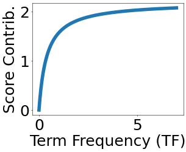
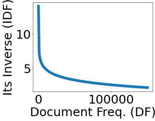
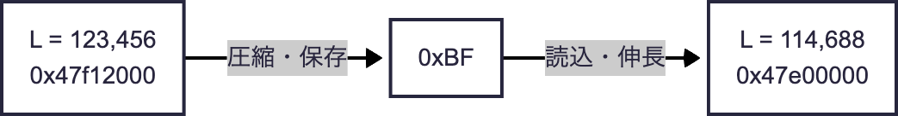
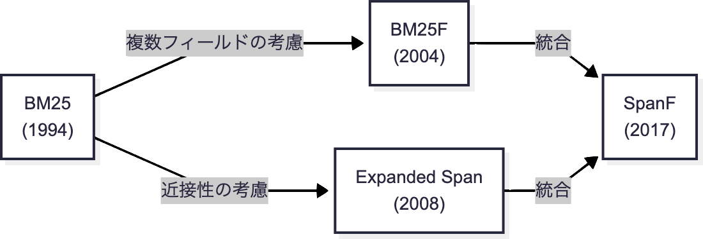

---
# https://marp.app/
marp: true

# https://x.com/y_hatt/status/1449951469961023488
style: |
    .columns {
        display: grid;
        grid-template-columns: repeat(2, minmax(0, 1fr));
    }
---

# BM25と実サービスへの適用とバリエーション

---

## BM25

---

## BM25

クエリに対してドキュメントにスコアをつける関数のひとつ
- クエリキーワードが多く出現するドキュメントほどスコアが高い (TF)
- 少数のドキュメントに出現するキーワードこそ重要 (IDF)
- 単に長いドキュメントにもキーワードは多く出現するので、
頻度をドキュメント長で正規化

数式で書くと以下
$$RSV_d =
\sum_{t \in q}\log\left[\frac{N}{\text{df}_t}\right] \cdot
\frac{(k_1 + 1)\text{tf}_{td}}{k_1((1 - b) + b \times (L_d / L_{avg})) + \text{tf}_{td}}$$
https://nlp.stanford.edu/IR-book/html/htmledition/okapi-bm25-a-non-binary-model-1.html

---

## BM25 > 計算例  $k_1 = 1.2, b = 0.75$

**バリ**島（インドネシア語: Pulau Bali）は、東南アジアのインドネシア共和国
**バリ**州に属する島である。首都ジャカルタがあるジャワ島のすぐ東側に位置し、
周辺の諸島とともに第一級地方自治体（Provinsi）である**バリ**州を構成する。
2014年の島内**人口**は約422万人。出典：フリー百科事典『ウィキペディア（Wikipedia）』

<table><tr><td>

</td><td>

- 文書長 $L = 113$
- $\text{tf}_{バリ} = 3$
- $\text{tf}_{人口} = 1$

</td><td>

</td><td>

- 平均文書長 $L_{avg} = 1{,}000?$
- 文書数 $N = 1{,}270{,}000$
- $\text{df}_{バリ} = 8{,}960$
- $\text{df}_{人口} = 120{,}000$

</td></tr></table>

$$
\frac{(1.2 + 1) \times 3}{1.2 \left( (1 - 0.75) + 0.75 \times \frac{113}{1{,}000} \right) + 3} \cdot
\log\frac{1{,}270{,}000}{8{,}960} +
\frac{(1.2 + 1) \times 1}{1.2 \left( (1 - 0.75) + 0.75 \times \frac{113}{1{,}000} \right) + 1} \cdot
\log\frac{1{,}270{,}000}{120{,}000}$$

---

## BM25 > 計算例 > TF

- キーワードが多く出現するドキュメントほどスコアが高いというアイデア
- とはいえ、関連度は比例ではなく飽和するので、スコアを丸める（右図）
    - この丸めの強さをパラメータ $k_1$ で制御（例では $1.2$）

<table><tr><td>

</td><td>

- $\text{tf}_{バリ} = 3$
- $\text{tf}_{人口} = 1$

</td></tr></table>

$$
\frac{(\mathbf{1.2} + 1) \times \mathbf 3}{\mathbf{1.2} \left( (1 - 0.75) + 0.75 \times \frac{113}{1{,}000} \right) + \mathbf 3} \cdot
\log\frac{1{,}270{,}000}{8{,}960} +
\frac{(\mathbf{1.2} + 1) \times \mathbf 1}{\mathbf{1.2} \left( (1 - 0.75) + 0.75 \times \frac{113}{1{,}000} \right) + \mathbf 1} \cdot
\log\frac{1{,}270{,}000}{120{,}000}$$

---

## BM25 > 計算例 > IDF

- 少数のドキュメントに出現するキーワードこそ重要というアイデア

<table><tr><td>

</td><td>

- 文書数 $N = 1{,}270{,}000$
- $\text{df}_{バリ} = 8{,}960$
- $\text{df}_{人口} = 120{,}000$

</td></tr></table>

$$
\frac{(1.2 + 1) \times 3}{1.2 \left( (1 - 0.75) + 0.75 \times \frac{113}{1{,}000} \right) + 3} \cdot
\log\mathbf{\frac{1{,}270{,}000}{8{,}960}} +
\frac{(1.2 + 1) \times 1}{1.2 \left( (1 - 0.75) + 0.75 \times \frac{113}{1{,}000} \right) + 1} \cdot
\log\mathbf{\frac{1{,}270{,}000}{120{,}000}}$$

---

## BM25 > 計算例 > 正規化

- 単に長いドキュメントにもキーワードは多く出現するので、
頻度をドキュメント長で正規化
- この正規化の強さをパラメータ $b$ で制御（例では $0.75$）

<table><tr><td>

</td><td>

- 文書長 $L = 113$

</td><td>

</td><td>

- 平均文書長 $L_{avg} = 1{,}000?$

</td></tr></table>

$$
\frac{(1.2 + 1) \times 3}{1.2 \left( (1 - \mathbf{0.75}) + \mathbf{0.75} \times \mathbf{\frac{113}{1{,}000}} \right) + 3} \cdot
\log\frac{1{,}270{,}000}{8{,}960} +
\frac{(1.2 + 1) \times 1}{1.2 \left( (1 - \mathbf{0.75}) + \mathbf{0.75} \times \mathbf{\frac{113}{1{,}000}} \right) + 1} \cdot
\log\frac{1{,}270{,}000}{120{,}000}$$

---

## 実サービスへの適用

---

## 実サービスへの適用

- 主に Learning to Rank（機械学習によるスコア計算）の特徴量として有用
- 実サービスだと、検索エンジンを一から作ることは稀なので、
既存の検索エンジンを利用するか、その上に実装することになる
    - OpenSearch
    - Solr
    - Vespa
    - ……

---

## 実サービスへの適用上の疑問

やっぱり疑問が出てくる

- ドキュメント長が極端に圧縮されているが、大丈夫なのか
- パラメータチューニングはどうするのか
- 実装してみるとスコアがバラつく

---

## 実サービスへの適用上の疑問 > ドキュメント長の圧縮

- Lucene (OpenSearch, Solr) は、ドキュメント長を8ビットまで圧縮して保存する
    - ドキュメント長が256通りしかないのと同じ

- これで BM25 を計算して精度は出るのか……？
- 実装して評価してみるしかない、例えば nDCG で

---

## 実サービスへの適用上の疑問 > パラメータチューニング

- BM25には、任意に設定できるパラメータ $k_1, b$ が存在
    - よく知られた値もあり、それを使うこともできる。が……
- nDCG に最適化したりできると良い
- 最適化手法については詳しく触れないですが、
原理的には、いろいろ試してみて評価尺度が最大のものを選ぶ
    - とりあえず、手動で何通りか試してみる
    - Grid Search
    - Coordinate Ascent
    - もっと高度なアルゴリズム

---

## 実サービスへの適用上の疑問 > スコアがバラつく

ということが実際にあった

### 原因

- 冗長化のため、検索エンジンのレプリカは複数存在、ほぼ独立に動作
- レプリカごとに削除済みドキュメント数が異なる
    - 削除済み == 検索結果に出ない
- BM25の計算にドキュメント数 $N$ を使うが、Luceneの制約で、
**このドキュメント数には削除済みも含まれる**
    - 結果、レプリカごとにBM25のスコアも異なる
    - レプリカをまたいでバランシングすると、スコアがバラつく

まず原因をつきとめるのにBM25の知識が役立ったパターン

---

## BM25F, Expanded Span, SpanF

---

## BM25F, Expanded Span, SpanF

- これまでBM25について話してきた
- 実サービスで重要なのは継続的な改善。
そのうち、もっとリッチなスコア関数を使いたくなる
    - 検索精度を上げたい
    - それによって、ユーザ体験を良くしたい
- 極端な話、スコア関数の背後にある考え方を理解していれば、
オリジナルのスコア関数を作ることも可能
- 作った例
    - BM25F + Expanded Span = SpanF

---

## BM25F

- 一般にドキュメントは
複数のフィールドから成る

$$\text{BM25F}(q, \beta) =
\sum_{\kappa \in q} \frac{\text{weight}(\kappa, \beta)}{k_1 + \text{weight}(\kappa, \beta)}
\log \frac{N - \text{bf}(\kappa) + 0.5}{\text{bf}(\kappa) + 0.5}$$

$$\text{weight}(\kappa, \beta) = \sum_{f \in \beta} \frac
{\text{occurs}(\kappa, f, \beta) \cdot boost_f}
{(1 - b_f) + b_f \cdot \frac{\text{length}(f, \beta)}{\text{avgLength}(f)}}$$

- 商品なら、商品名・説明文・ストア名・…… 商品名が重要そう
- 複数のフィールドに重みづけして考慮する拡張がBM25F
    Stephen Robertson et al. 2004. Simple BM25 Extension to Multiple Weighted Fields. In CIKM. 42–49.
- これは今でも、単体でランキングを生成して
研究用のベースラインにできるくらいには「強い」手法
- もちろん、Learning to Rank（機械学習によるスコア計算）の特徴量としても有用

---

## Expanded Span

- キーワードの出現頻度も重要だが、近接性も重要
    - 例：
        - 正例：3.5インチ**HDDケース**USB3.0対応版
        - 負例：PC**ケース**の静音性と**HDD**の容量が異なるモデル
- 近接性を考慮する拡張が Expanded Span
    Ruihua Song et al. 2008. Viewing Term Proximity from a Different Perspective. In ECIR. 346–357.
    - 互いに近接したキーワードの出現を重視する

---

## SpanF（と社内では呼んでいます）

- こうなると、BM25FとExpanded Spanを両立させたくなる
    - 複数のフィールドに重み付けして考慮し、かつ、近接性も考慮する
- 実際、自然に両立でき https://arxiv.org/abs/1709.03260、社内では有効だった

---

## BM25 > まとめ

---

## BM25 > まとめ

- 基本的なスコア関数を押さえておくことは未だに重要
    - 入りきらなかったトピックとしても、
    BM25によるハイブリッド検索、言語モデル時代の発展形BM42、……
- 実サービスを改善しようと思うと、
既存のシステムに、入れようとしている改善が馴染むか？
を考慮することになる（圧縮、パラメータ、分散構成……）
- やっぱり評価は重要。結局なんでも評価してみることになる
- 基本的なスコア関数は、この言語モデル時代にも依然として重要
