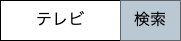
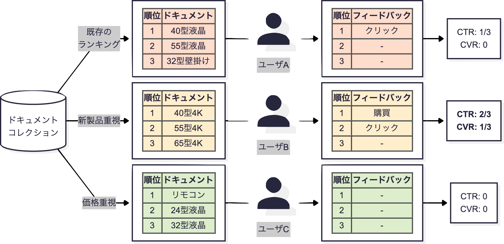
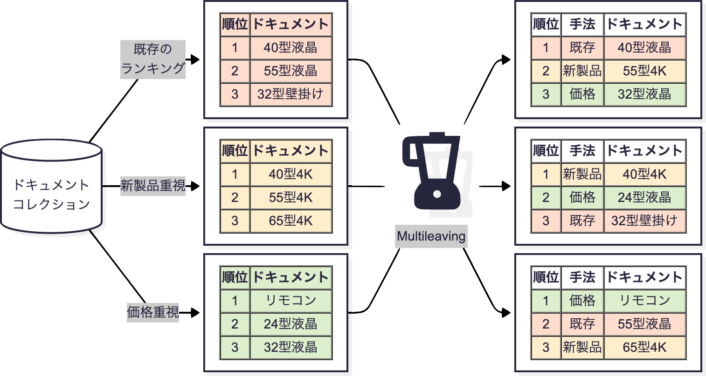
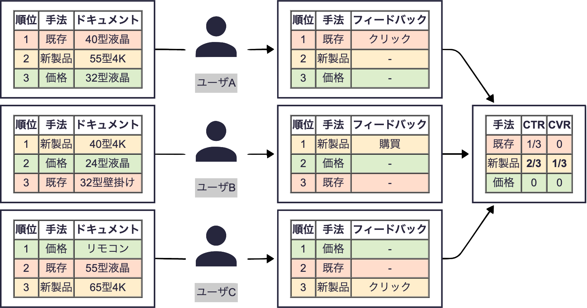
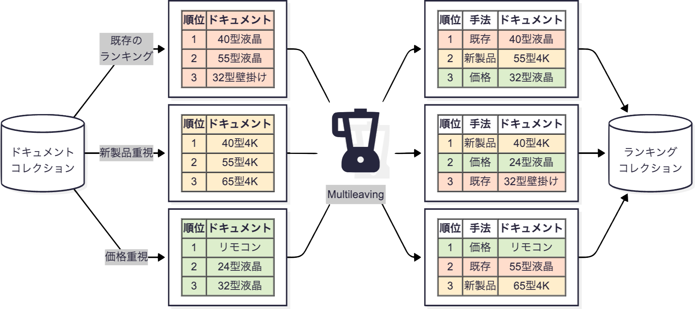
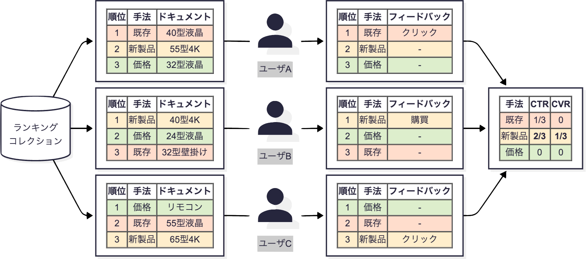
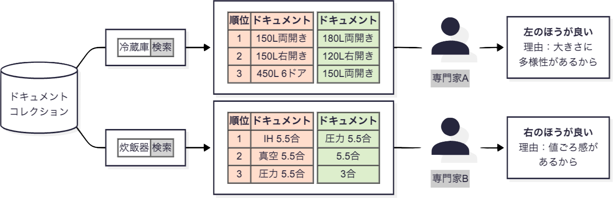

---
# https://marp.app/
marp: true
math: mathjax
---

# Interleaving/Multileavingと実サービスへの応用

---

## Interleaving/Multileaving

- オンライン評価の、応用的な話
- 一言で説明すると：
既存のランキングと改良した（はずの）ランキングを混ぜてユーザに見せ、
「改良したランキングに由来するドキュメントのほうがクリックされる」
傾向にあれば、改良は成功
    - 混ぜるランキングが2つなら interleaving
    - 3つ以上なら multileaving
- 既存のA/Bテストを置き換えるもの

---

## そもそもA/Bテストとは

- ユーザをバケットAとBに分ける
    - 単純化のために2バケットとしたが、3バケット以上でも可能
- バケットAには既存のランキングを、Bには改良版を見せる
- バケットBの反応が良ければ、改良は成功、サービスに導入
    - 反応として一般にはclick through rate (CTR), conversion rate (CVR)
    - Eコマースサービスであれば、流通総額
    - など……

---

## A/Bテストの例 

---

## A/Bテストの課題

**一人のユーザは、どちらか片方のランキングしか見ない**

- あるユーザの検索意図（クエリ）や好みは、
どちらか片方のランキング手法の評価にのみ影響する
- 結果、評価にかかる時間が長くなったり、
これらの差分に小規模な改良が埋もれたりする

---

## Interleaving/Multileaving とは

**一人のユーザが、複数のランキングを見て比較するのに近い**

- A/Bテストと同様、複数の手法でランキングを生成する
- それらのランキングを「混ぜて」ユーザに見せる
- 各ドキュメントが「どの手法から来たか」に着目して、
フィードバックを集計する
    - 例えば、どの手法から来たドキュメントが最もクリックされたか？

---

## Multileavingの例 

---

## Multileavingの例  (continued)

---

## Interleaving/Multileaving の課題

- 偏りのない混ぜ方
- フィードバックを各手法の評価に偏りなく反映する方法

などがあり、これらを部分的に解決する複数の手法が提案されている

- Team Draft (TDM), Probabilistic (PM), Optimized (OM), Pairwise Preference (PPM), ……

そして本スライドで取り上げるのは**実サービスへの適用上の課題**

---

## 実サービスへの適用上の課題 (Interleaving)

例によって、これも、そのまま適用できない
- 複数手法でランキングを生成し、混ぜるコスト
- 混ぜた結果のランキングの質のリスク

---

## 複数手法でランキングを生成し、混ぜるコスト

- $N$手法でランキングを生成すると、処理負荷が$N$倍
    - 通常、実サービスの環境では吸収できない負荷
    - （A/Bテストではユーザあたり1手法なので等倍）
- ランキングを混ぜるコストも余分にかかる
    - こちらは通常、たいした負荷ではないが、
    例えばOMという手法で混ぜると、線型計画問題を解く必要がある
    Anne Schuth *et al.* 2014. Multileaved Comparisons for Fast Online Evaluation. In *CIKM*, pp. 71-80.

---

## 複数手法でランキングを生成し、混ぜるコスト (continued)

- 対策1. 事前にクエリを選び、ランキングを生成しておけば、
クエリ時にはそれを返すだけで良い
    - 先ほどの例だと、前半スライドの内容までは事前に実行しておき、
    ユーザのクエリに応じて後半スライドの内容を実行する
    Makoto P. Kato *et al.* 2017. Overview of the NTCIR-13 OpenLiveQ Task. In *NTCIR*, pp. 85-90.
- ただし、頻出するクエリのみについての評価になる

---

## ランキングの事前計算の例  に備えて、ランキングを混ぜておく

---

## ランキングの事前計算の例 (continued)  が実際に来たら

---

## 複数手法でランキングを生成し、混ぜるコスト (continued)

- 対策2. 大規模データは複数台のサーバに分散検索させるのが普通。
各サーバに異なるランキング手法を使わせれば良い
ヤフー株式会社．2020. 情報処理システム，および情報処理方法．特許第7231468号
（アカデミックな評価はまだですが……）

---

## 分散検索の例

- ドキュメントコレクション全体を複数のシャードに分割、検索

---

## 分散検索の例 (continued)

- ドキュメントコレクション全体を複数のシャードに分割、検索

---

## 各サーバに異なるランキング手法を使わせる例

- ドキュメントコレクション全体を複数のシャードに分割、検索

---

## 混ぜた結果のランキングの質のリスク

テストのために質の悪いランキングを見せて、
ユーザが離れたら本末転倒

- 対策1. 元のランキングで $k$ 位までのアイテムに限って
出力すれば、ある程度の質が担保されるという立場をとる
    - 例えば、前述のOMはこれ
- この点を考慮しない手法に例えばPM
Anne Schuth *et al.* 2015. Probabilistic Multileave for Online Retrieval Evaluation. In *SIGIR*, pp. 955-958
    - 下位の無関係なドキュメントを出力してしまうことがある

対策2. ちゃんと人の目で事前チェックする（定性評価）

---

## 定性評価

そもそも Interleaving/Multileaving に限らず、
何かをユーザに見せる前には人の目でチェックしたほうが良い
- これも実サービスの特徴だと思います
- nDCGなどの定量評価とは相補的な関係にある
    - 少数のクエリに関して人の目で評価する vs.
    多数のクエリに関して機械的に評価する
- 作業者は開発者だったり、専門のチームだったり
- 手法は例えば Side-By-Side (SBS)

---

## 定性評価 (SBS) の実施例

※ 先入観を避けるため、どちらが改善版かは伏せる

---

## まとめ (Interleaving/Multileaving)

- 実サービスでは、ユーザ離れを起こしたくないので、
研究室よりもユーザテストには慎重なことが多い
- 基本は前述の nDCG および本章で触れた SBS と、
それらをパスしたら実施される A/Bテスト
- 今のところ、やや応用的な話題として interleaving/multileaving がある
    - 評価にかかる時間の短縮や、小規模な改良の正確な評価につながる
    - ただし、処理負荷、実装の複雑さなど、実サービスへの適用上の課題あり
