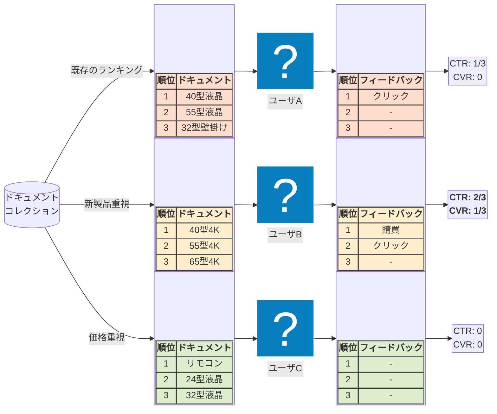

---
# https://marp.app/
marp: true
---

```mermaid
%%{init: {
  "flowchart": {
    "rankSpacing": 40,
    "nodeSpacing": 1,
    "padding": 1
  }
}}%%
flowchart LR
    0[(ドキュメント<br/>コレクション)]
    1A[
      <table border="1" cellspacing="0" bgcolor="#fdc">
        <tr><th>順位</th><th>ドキュメント</th></tr>
        <tr><td>1</td><td>40型液晶</td></tr>
        <tr><td>2</td><td>55型液晶</td></tr>
        <tr><td>3</td><td>32型壁掛け</td></tr>
      </table>
    ]
    1B[
      <table border="1" cellspacing="0" bgcolor="#fec">
        <tr><th>順位</th><th>ドキュメント</th></tr>
        <tr><td>1</td><td>40型4K</td></tr>
        <tr><td>2</td><td>55型4K</td></tr>
        <tr><td>3</td><td>65型4K</td></tr>
      </table>
    ]
    1C[
      <table border="1" cellspacing="0" bgcolor="#dec">
        <tr><th>順位</th><th>ドキュメント</th></tr>
        <tr><td>1</td><td>リモコン</td></tr>
        <tr><td>2</td><td>24型液晶</td></tr>
        <tr><td>3</td><td>32型液晶</td></tr>
      </table>
    ]
    2A@{icon: "mdi:user", label: "ユーザA", h: "100"}
    2B@{icon: "mdi:user", label: "ユーザB", h: "100"}
    2C@{icon: "mdi:user", label: "ユーザC", h: "100"}
    3A[
      <table border="1" cellspacing="0" bgcolor="#fdc">
        <tr><th>順位</th><th>フィードバック</th></tr>
        <tr><td>1</td><td>クリック</td></tr>
        <tr><td>2</td><td>-</td></tr>
        <tr><td>3</td><td>-</td></tr>
      </table>
    ]
    3B[
      <table border="1" cellspacing="0" bgcolor="#fec">
        <tr><th>順位</th><th>フィードバック</th></tr>
        <tr><td>1</td><td>購買</td></tr>
        <tr><td>2</td><td>クリック</td></tr>
        <tr><td>3</td><td>-</td></tr>
      </table>
    ]
    3C[
      <table border="1" cellspacing="0" bgcolor="#dec">
        <tr><th>順位</th><th>フィードバック</th></tr>
        <tr><td>1</td><td>-</td></tr>
        <tr><td>2</td><td>-</td></tr>
        <tr><td>3</td><td>-</td></tr>
      </table>
    ]
    4A[CTR: 1/3<br/>CVR: 0]
    4B[<strong>CTR: 2/3<br/>CVR: 1/3</strong>]
    4C[CTR: 0<br/>CVR: 0]
    0 -- 既存のランキング --> 1A --> 2A --> 3A --> 4A
    0 -- 新製品重視 --> 1B --> 2B --> 3B --> 4B
    0 -- 価格重視 --> 1C --> 2C --> 3C --> 4C
```
