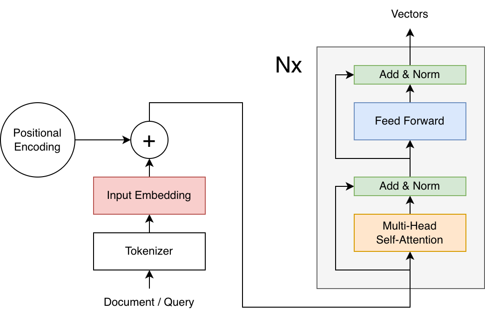
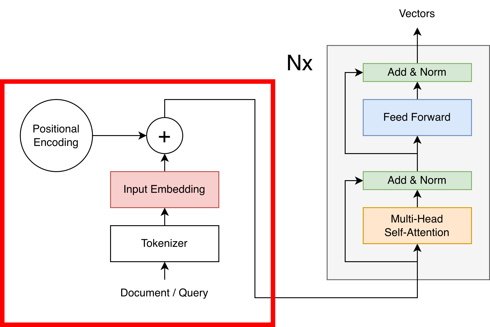
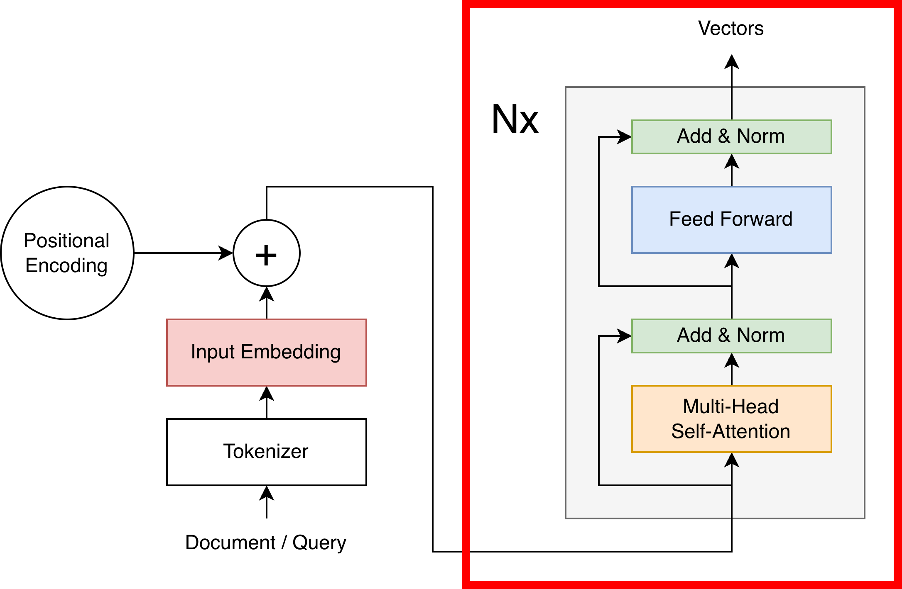
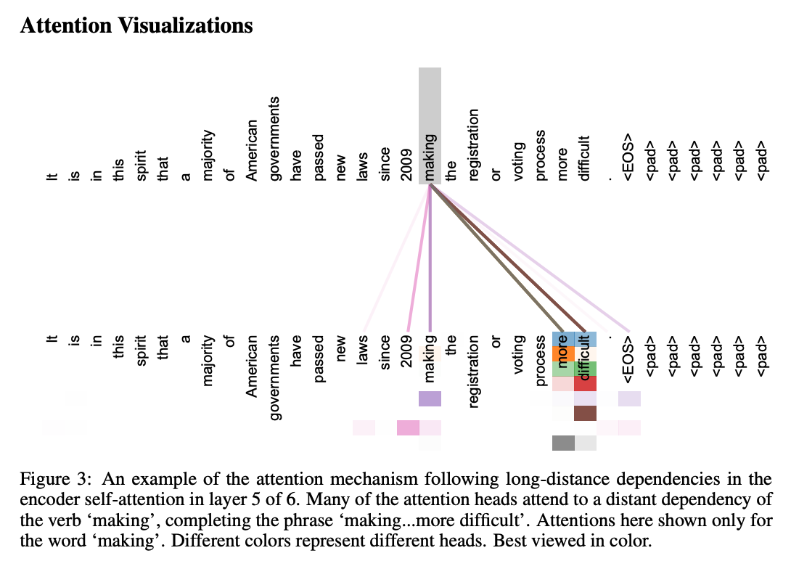
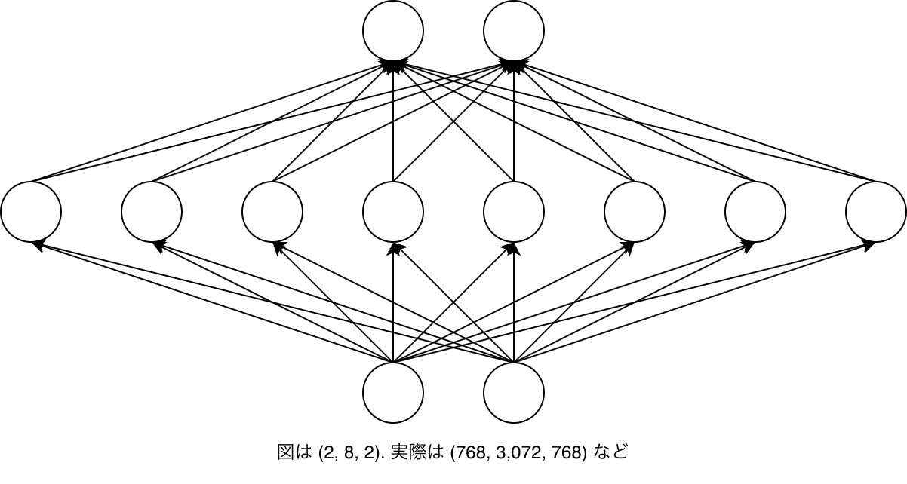
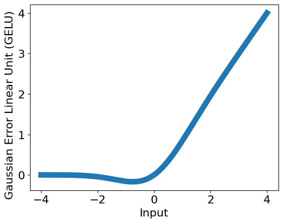
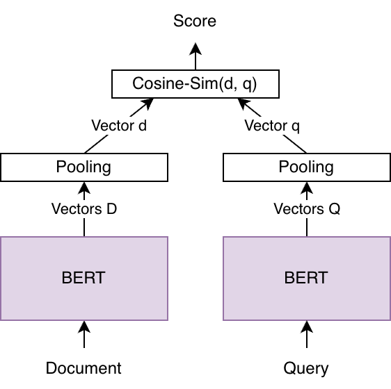
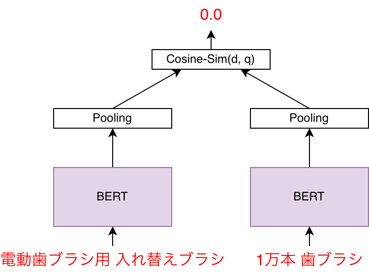
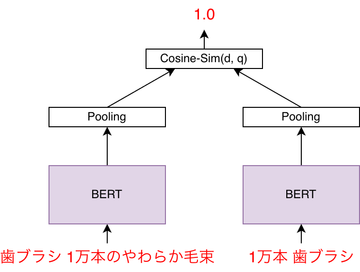
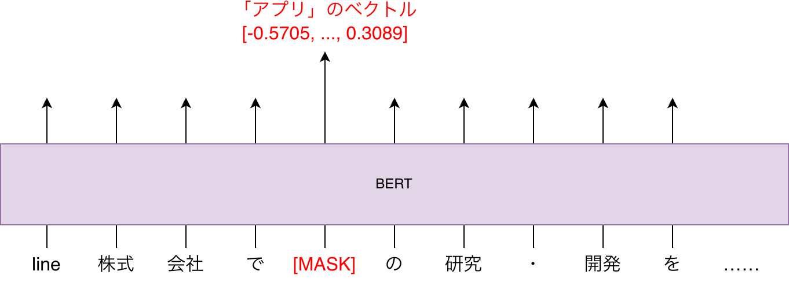

---
# https://marp.app/
marp: true

# https://x.com/y_hatt/status/1449951469961023488
style: |
    .columns {
        display: grid;
        grid-template-columns: repeat(2, minmax(0, 1fr));
    }
math: mathjax
---

# DNN (Deep Neural Network)

---

## DNN (Deep Neural Network)

- Deep: 同じ部品を重ねる
- Neural Network: （もともとは）神経細胞のモデル
    - 数学的には、ほぼ行列積

---

## DNNの特長

いろいろなタスクで**最先端の**モデル
- 同じ部品を重ねるだけで精度が上がる場合がある
- 自然言語処理において、いったん特徴量を抽出しなくても良い
    - 例えばキーワード検索も自然言語処理
    - 言い換えれば、内部で自動で特徴量を抽出してくれる

---

## BERT: DNNの有名な実装の一つ



---

## BERTの具体例

例によって具体例で説明します

<br />

『高性能・高速・軽量な日本語言語モデル **LINE DistilBERT**を公開しました』
- https://engineering.linecorp.com/ja/blog/line-distilbert-high-performance-fast-lightweight-japanese-language-model

---

## BERTの処理の前半

**自然言語文**を入力すると、その潜在的な意味が**ベクトル列**で出力される部分

<div class="columns"><div>

- 例えば検索キーワードや商品名も
自然言語文
- ベクトル列は「数値の列の列」

前半では、以下の処理を行う

- Tokenizer
    - MeCab
    - SentencePiece
- Input Embedding; 埋め込み
- Positional Encoding; 位置符号化

</div><div>



</div></div>

---

## Tokenizer > MeCab

有名な形態素解析器

```python
from MeCab import Tagger

tagger = Tagger("-Owakati")
for query in QUERIES:
    display(wakati.parse(query).split())
```

（再掲）Janome

```
from janome.tokenizer import Tokenizer

tokenizer = Tokenizer(wakati=True)
for query in QUERIES:
    display(list(tokenizer.tokenize(query)))
```

---

## Tokenizer > MeCab (contunued)

```python
QUERIES = ["恐竜", "無洗米 10kg", "電球ソケット アンティーク"]
```


```python
['恐竜']
['無洗', '米', '10', 'kg']
['電球', 'ソケット', 'アンティーク']
```

（再掲）Janome

```python
['恐竜']
['無', '洗米', ' ', '10', 'kg']
['電球', 'ソケット', ' ', 'アンティーク']
```

---

## Tokenizer > SentencePiece

さらに細かい**サブワード**に分割してバリエーションを減らす
- 基本のアイデアはバイト対符号化 (Byte Pair Encoding, BPE)
    - バイトをトークンとすると、どんな文字列も表現できるが長くなる
    - 頻出するトークン列に専用のトークンを割り当てる圧縮を繰り返す

---

## Tokenizer > SentencePiece (continued)

SentencePieceの語彙を見ると、日本語で頻出するトークンがわかる

```bash
% brew install sentencepiece
% spm_export_vocab --model=spiece.model --output=vocab.txt
% cat vocab.txt | grep あ | head
▁あ     -17
▁ある   -40
▁あり   -66
▁あっ   -168
▁あれ   -999
▁あなた -1049
▁あまり -1445
▁ありが -1603
▁あと   -1673
▁ありがとう     -1847
%
```

---

## Tokenizer > SentencePiece (continued)

```python
from transformers import AutoTokenizer
tokenizer = AutoTokenizer.from_pretrained("./line-distilbert-base-japanese",
                                          trust_remote_code=True)
for query in QUERIES:
    display(tokenizer(query))
```


```bash
{'input_ids': [2, 2283, 11743, 3], 'attention_mask': [1, 1, 1, 1]}
# => ["[CLS]", "_恐", "竜", "[SEP]"]

{'input_ids': [2, 244, 11214, 1198, 222, 522, 10340, 3],'attention_mask': [1, ...
# => ["[CLS]", "_無", "洗", "_米", "_10", "_k", "g", "[SEP]"]

{'input_ids': [2, 308, 10860, 398, 1195, 9862, 362, 3], 'attention_mask': [1, ...
# => ["[CLS]", "_電", "球", "_ソ", "ケット", "_アンティ", "ーク", "[SEP]"]
```

---

## Input Embedding; 埋め込み

トークンのバリエーション（語彙）を有限にできたので、
各トークンにベクトル（数値の列）を割り当てる

```bash
# ["[CLS]", "_恐", "竜", "[SEP]"] =>
tensor([[[ 0.0248, -0.1918, -0.0153,  ..., -0.2041,  0.0016, -0.1256],
         [-0.4989, -1.1592, -1.1996,  ...,  0.1555, -0.4629,  0.5727],
         [-0.9997,  0.4875, -0.2782,  ..., -0.2958,  0.8482,  0.0511],
         [ 0.0834,  0.1228, -0.1548,  ..., -0.4154, -0.2820,  0.2073]]],
```

---

## Positional Encoding; 位置符号化

同じトークンでも位置によって意味は異なることを、​
トークンのベクトルに「位置のベクトル」を加算して表現する

- 「位置のベクトル」は例えば下記の数式によって決める​

$$PE_{(pos, 2i)} = \sin\frac{pos}{10000^{\frac{2i}{d_\text{model}}}} $$
$$PE_{(pos, 2i + 1)} = \cos\frac{pos}{10000^{\frac{2i}{d_\text{model}}}} $$

---

## BERTの処理の後半

**ベクトル列**を入力すると、**ベクトル列**が出力される部分

<div class="columns"><div>

- 入出力の型が同じなので、同じ構造を繰り返せる
    - 典型的には12回

後半では、以下の処理を行う

- Attention;「注意」
- Feed Forward

</div><div>



</div></div>

---

## Attention;「注意」

あるベクトルに他のベクトルを補う
- 同じ単語を構成する他のトークン（のベクトル）を補う
    - `_恐` ベクトル ＋ `竜` ベクトル ＝ `_恐竜` ベクトル
- 名詞のトークンに対して、その形容詞のトークンを補う、など
    - `_無洗` ベクトル ＋ `_米` ベクトル ＝ `_無洗_米` ベクトル

<br />

注意を繰り返して、徐々に大きな構造をとらえる
- また、層ごとにも複数通りの注意を行う (multi-head)
- 最終的に `_電球_ソケット_アンティーク` のように複雑な意味の文もベクトルに

---

## Attention (continued)

<div class="columns"><div>

- Attention Is All You Need,
https://arxiv.org/abs/1706.03762

</div><div>



</div></div>

---

## Feed Forward

最も基本的なニューラルネットワーク。BERTから見ると部品

<div class="columns"><div>

- 行列積、からの
- 非線形関数



</div><div>



</div></div>

---

## ヘッド

BERTにより自然言語文をベクトル列に変換できたが、この後どうするのか？


具体的なタスクに合わせて用意する構造、**ヘッド**に入力する


---

<div class="columns"><div>

## Query-Document Interaction

- 検索におけるヘッド
- 典型的には**ドキュメントとクエリの
2ベクトル列**を入力、**スコア**を出力

<dl>
    <dt>Pooling</dt>
    <dd><ul>
        <li>ベクトル列を入力、ベクトルを出力</li>
        <li>具体的には要素ごとに平均するなど</li>
    </ul></dd>
    <dt>Cosine-Sim（コサイン類似度）</dt>
    <dd><ul>
        <li>2ベクトルを入力、数値を出力</li>
        <li>ほかドット積や距離などのことも</li>
    </ul></dd>
<dl>

</div><div>



</div></div>

---

## DNNの訓練

- 以上のような構造を作ったが、めちゃくちゃパラメータが多い
- もちろん自動的に最適化（訓練）する

DNNの訓練は：
- 事前学習と微調整（ファインチューニング）の2段階に分けられ
- まずは事前学習ずみモデルを使えば良いとされる

背景知識として、誤差逆伝播から説明します

---

## 誤差逆伝播

いろいろ背景はあるが、要はDNNに**入力と期待される出力を与える**と訓練できる

<div class="columns"><div>



</div><div>



</div></div>

---

## 事前学習

**自然言語を獲得**する。トークンの穴埋めを解かせるのが良いとされる
- これを Masked Language Modeling, MLM と呼ぶ



---

## 微調整（ファインチューニング）

具体的なタスクに対して訓練する
- 検索においてはドキュメントとクエリの入力、スコアの出力

<div class="columns"><div>


</div><div>


</div></div>
