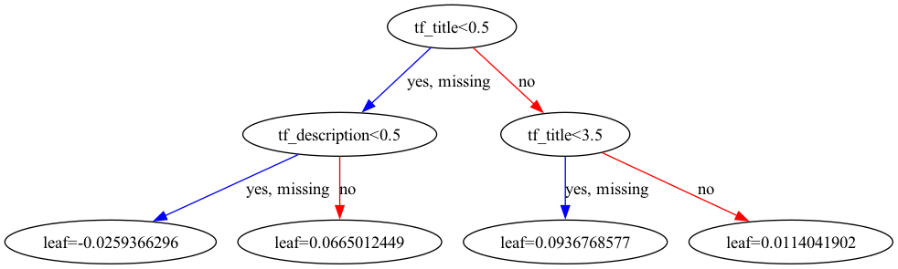
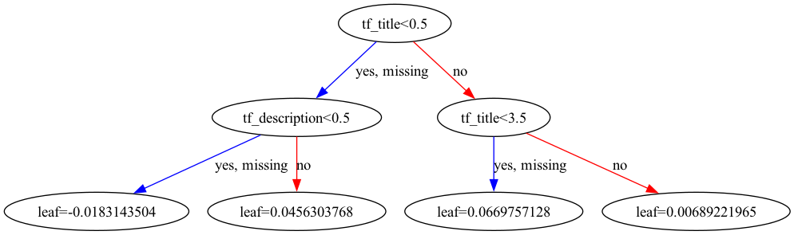
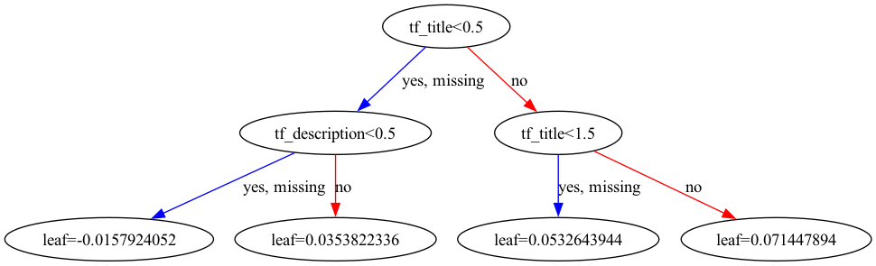
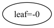
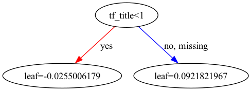
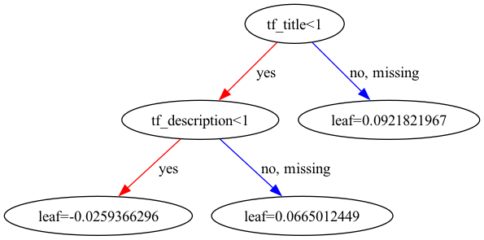
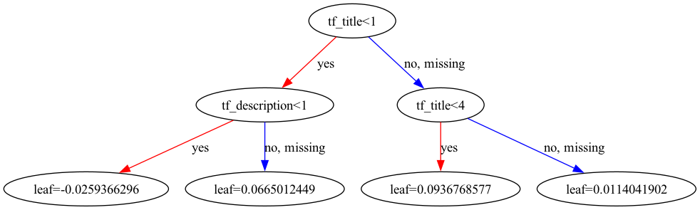

---
# https://marp.app/
marp: true

style: |
    .lowlight {
        color: gray;
    }
---

# GBDT (Gradient Boosting Decision Trees)

---

## GBDT (Gradient Boosting Decision Trees)

- Gradient: 目的関数の勾配
- Boosting: 複数のシンプルだが精度の低いモデルを協調させる
- Decision Trees: 決定木
    - ただし、ここではスコアを予測するので回帰木

---

## GBDTの全体像

それぞれの回帰木は数値を出力。その総和をスコアとするモデル

---

## GBDTの特長

いろいろなタスクで**スタンダードな**モデル
- 重要そうな特徴量を自然に選択してくれる
- できたモデルが人間にも理解しやすい

---

## 回帰木

GBDTの部品。見ての通り、人間にも理解しやすい
- クエリに対して、ドキュメントごとに数値が出る（回帰）
- よく使われる特徴量、そうでない特徴量がある（特徴選択）

---

## 回帰木の訓練

- 最初は、すべてのドキュメントに同じ数値を振る 

 

- ひとつずつ分岐を作る。目的関数を最大化するように選ぶ
    - どこで・どの特徴量で・どの値で分岐し、数値はいくつにするか

---

## 回帰木の訓練

- 最初は、すべてのドキュメントに同じ数値を振る 

 

- ひとつずつ分岐を作る。目的関数を最大化するように選ぶ
    - どこで・どの特徴量で・どの値で分岐し、数値はいくつにするか

---

## 回帰木の訓練

- 最初は、すべてのドキュメントに同じ数値を振る 

 

- ひとつずつ分岐を作る。目的関数を最大化するように選ぶ
    - どこで・どの特徴量で・どの値で分岐し、数値はいくつにするか

---

## 回帰木の訓練

- 最初は、すべてのドキュメントに同じ数値を振る 

 

- ひとつずつ分岐を作る。目的関数を最大化するように選ぶ
    - どこで・どの特徴量で・どの値で分岐し、数値はいくつにするか

---

## ブースティング

回帰木そのものも、ひとつずつ作る
- 過去の回帰木を推論しても残った誤差を最小化するように作る

---

## ブースティング

回帰木そのものも、ひとつずつ作る
- 過去の回帰木を推論しても残った誤差を最小化するように作る

---

## ブースティング

回帰木そのものも、ひとつずつ作る
- 過去の回帰木を推論しても残った誤差を最小化するように作る

---

## ブースティング

回帰木そのものも、ひとつずつ作る
- 過去の回帰木を推論しても残った誤差を最小化するように作る

