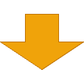

---
# https://marp.app/
marp: true
---

# ランキング学習

---

## 具体例

で説明したほうが、絶対に分かりやすい
- しかし、本番データを使うわけにいかないので……

<br />

amazon-science/esci-data
- https://github.com/amazon-science/esci-data
- Apache License 2.0
    - https://github.com/amazon-science/esci-data/blob/main/LICENSE

---

## 具体例 (continued)

- **検索キーワード**（クエリ）と**商品**（ドキュメント）のデータセット
- 4段階の正解の関連度 `{E, S, C, I}`
    - Exact, Substitute, Complement, Irrelevant
    - 正解、代替可能、相補的、関連なし

|query|product_title|esci_label|
|---|---|---|
|1万本 歯ブラシ|歯ブラシ 1万本のやわらか毛束|Exact 正解|
|1万本 歯ブラシ|ハブラシ 3列超コンパクトヘッド|Substitute 代替可能|
|1万本 歯ブラシ|歯のホワイトニング 歯磨き粉|Complement 相補的|
|1万本 歯ブラシ|電動歯ブラシ用 入れ替えブラシ|Irrelevant 関連なし|

---

## ランキング

実サービスでは、真の関連度は分からない

|query|product_title|esci_label|
|---|---|:-:|
|1万本 歯ブラシ|ハブラシ 3列超コンパクトヘッド|？|
|1万本 歯ブラシ|電動歯ブラシ用 入れ替えブラシ|？|
|1万本 歯ブラシ|歯のホワイトニング 歯磨き粉|？|
|1万本 歯ブラシ|歯ブラシ 1万本のやわらか毛束|？|

そこで検索結果のドキュメントを、**意図を満たす可能性の順**に並べるのが**ランキング**
- ユーザは：
    - 検索意図を満たすドキュメントを見たく、かつ、
    - 上位のドキュメントを見やすいため、こうすると便利

---

## ランキングを手動でやると

当然コストが高い
- すべてのクエリに対してやるのは非現実的
- 余談：非常によくあるクエリに対しては取りうる手段ではある

<br />

具体例のデータセットだけでも……

|Language|# Queries|# Judgements|
|---|--:|--:|
|Japanese|10,407|297,883|

すでにコストが高いうえに、実サービスには未知のクエリも来る

---

## ランキング学習

ランキングを自動でやる
- クエリに対して、ドキュメントにスコアをつけ、その降順に並べる

|query|product_title|スコア|
|---|---|--:|
|1万本 歯ブラシ|歯ブラシ 1万本のやわらか毛束|0.987|
|1万本 歯ブラシ|歯のホワイトニング 歯磨き粉|0.765|
|1万本 歯ブラシ|ハブラシ 3列超コンパクトヘッド|0.543|
|1万本 歯ブラシ|電動歯ブラシ用 入れ替えブラシ|0.321|

- このスコアを計算するモデルを機械学習するのがランキング学習

---

## ランキング学習とモデル

ランキング学習におけるモデルとはスコアのつけかた
- 余談：ドキュメントの並べかたを直接モデリングすることもある

<br />

ランキング学習におけるモデルは、以下の性質を備えるべき：
- 精度が高い
    - 並べた結果がユーザの検索意図を満たす可能性が高い
- 推論が高速
    - クエリが来てからランキングを返すまでが早く、ユーザを待たせない
    - また、リソースを長時間占有しないので、コストが安くすむ

---

## ランキング学習とモデル (continued)

他にも：

- ロバストである
    - 精度が極端に低いクエリが少ない
- 多様性がある
    - 複数の検索意図が考えられるとき、その多くを満たす
- 世の中で広く使われていて、知見が貯まっている、など

---

## 具体的なモデル

今回は以下を紹介
- 単一の特徴量
- 線形モデル
- GBDT
- DNN

---

## 単一の特徴量

---

## 単一の特徴量

なんらかの値（特徴量）を抽出して、その値の順に並べる
- 例えばトークンの出現頻度 (term frequency, TF)

シンプルな例

|query|product_title|tf|
|---|---|---|
|恐竜|DVD付 新版 恐竜 (小学館の図鑑 NEO)|1|

---

## トークナイズ

出現頻度を数えるには、まずクエリとドキュメントを
それぞれ**トークン**に区切る
- 日本語では形態素解析して、形態素の原形を取ることが多い
- Pythonで書かれた形態素解析器Janomeの例

```python
from janome.tokenizer import Tokenizer

tokenizer = Tokenizer(wakati=True)
for query in QUERIES:
    display(list(tokenizer.tokenize(query)))
```

---

## トークナイズ (continued)

```python
QUERIES = ["恐竜", "無洗米 10kg", "電球ソケット アンティーク"]
```



```python
['恐竜']
['無', '洗米', ' ', '10', 'kg']
['電球', 'ソケット', ' ', 'アンティーク']
```

（空白文字は捨てることが多い）

---

## トークンの出現頻度 (term frequency, TF)

あとは：
- クエリ側のトークンがドキュメント側に出現する頻度を数える

|query|product_title|tf|
|---|---|---|
|恐竜|DVD付 新版 恐竜 (小学館の図鑑 NEO)|1|
|恐竜|TEMI 恐竜 おもちゃ フィギュア 恐竜世界 恐竜セット パズル 6歳以上...|5|
|恐竜|Tagitary 恐竜フィギュア おもちゃ 17点セット 誕生日プレゼント 収納...|3|
|恐竜|ウォーキングwithダイナソー　太古の地球へ（吹替版）|0|

- これが、検索において最も基本的な特徴量の一つ、TF
- 実用上は転置インデックスという高速な構造を作ることが多い

---

## スコア

クエリに対してドキュメントをTFの降順でランキングできる

|query|product_title|tf|
|---|---|---|
|恐竜|TEMI 恐竜 おもちゃ フィギュア 恐竜世界 恐竜セット パズル 6歳以上...|5|
|恐竜|Tagitary 恐竜フィギュア おもちゃ 17点セット 誕生日プレゼント 収納...|3|
|恐竜|DVD付 新版 恐竜 (小学館の図鑑 NEO)|1|
|恐竜|ウォーキングwithダイナソー　太古の地球へ（吹替版）|0|

このように、何かの値の降順にソートすると検索意図を
満たす可能性が高いと考えられる場合、その値を**スコア**と呼ぶ

---

## モデルの構造的改善

単一の特徴量には明らかに欠点があるので、より高度なモデルを考えていく

- 線形モデル
- GBDT
- DNN

---

## 線形モデル

---

## 線形モデル

線形モデルでは複数の特徴量を抽出して、それらの重みつき和をスコアとする

- 例えば商品には商品名と説明文があり、それらのTFを抽出

```
Score = a * TF(title) + b * TF(desc.)
```

- これによって説明文も考慮してランキングでき、精度が高まると考えられる
- この `a, b` が重みで、人が与えることも、機械学習もできる

---

## （参考）目的関数

何が最適と考えて機械学習すれば良いのか？ → 目的関数
- 例：**NDCG**. ランキングの評価尺度のひとつ
    - Gain: クエリごとドキュメントごとに検索意図を満たす効果を点数化
        - 例えば `{E, S, C, I} -> {4, 2, 1, 0}`
    - Cumulative: ランクインしたドキュメントの点数の総和がランキングの点数
    - Discounted: ただし、下位のドキュメントの点数は割り引く
        - 例えば、1位が等倍とすると、3位は半分とか
    - Normalized: 特定のクエリに偏らないように点数を正規化

---

## （参考）最適化

- 手動
- グリッドサーチ
    - 例：`a = {1, 2, 3}`
    - 特徴量が増えると組み合わせ爆発
- **Coordinate Ascent**
    - 1つずつ最適化
    - どれを動かしても目的関数が改善しなくなったら終了
    - 局所解だが実用的

など無数の手法

---

## 具体例（前処理）

- 正解の関連度を数値化。例えば `{E, S, C, I} -> {4, 2, 1, 0}`
- クエリごとにドキュメントをまとめる
    - ランキング学習ではクエリごとにドキュメントを並べるので
- 特徴量、例えば商品名と説明文それぞれのTFの抽出

訓練データの全体像は例えば以下のようになる

```bash
% head train.letor

2 qid:116 1:0 2:0 #docid = B07XPBDWZ6
4 qid:116 1:1 2:0 #docid = B07X8GQTCX
2 qid:116 1:0 2:0 #docid = B09GTY16XW
4 qid:116 1:0 2:0 #docid = B081C928FL
4 qid:116 1:1 2:0 #docid = B08VXZRD58
...
```

---

## 具体例（線形モデルのランキング学習）

RankLib https://github.com/codelibs/ranklib を使う例
- ランキング学習のライブラリ
- NDCG および Coordinate Ascent (`-ranker 4`) をサポート

```bash
% java -jar RankLib.jar -train train.letor \
>     -metric2t NDCG@10 -ranker 4 -save ca.ranklib
...
Model saved to: ca.ranklib
% cat ca.ranklib
...
1:0.9484442883650408 2:0.05155571163495928
%
```

（再掲）`Score = a * TF(title) + b * TF(desc.)`
