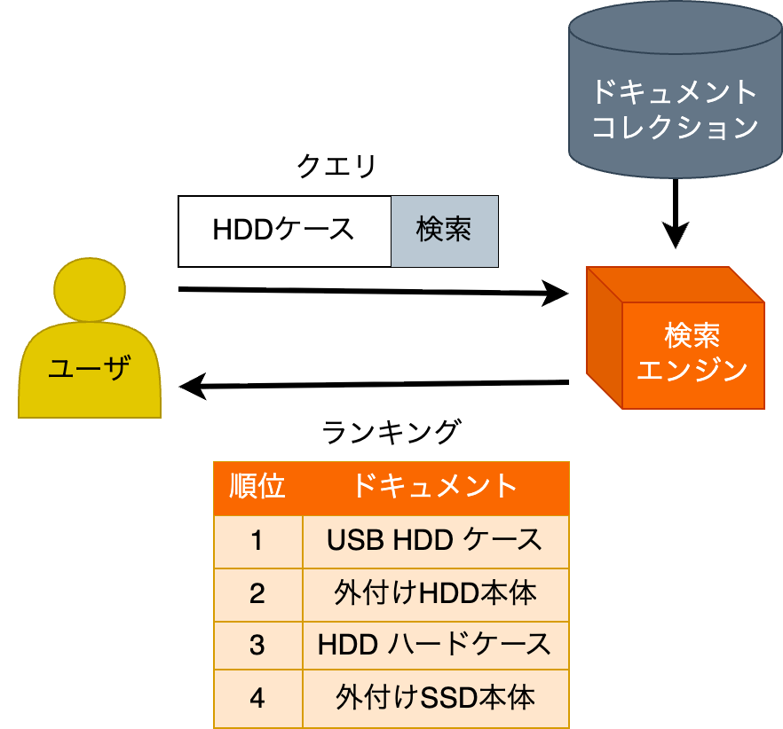
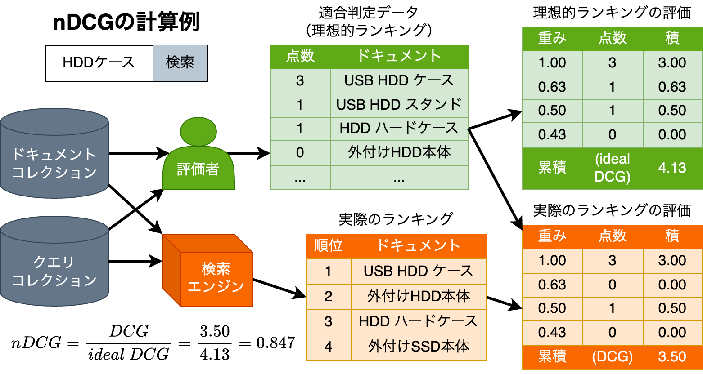
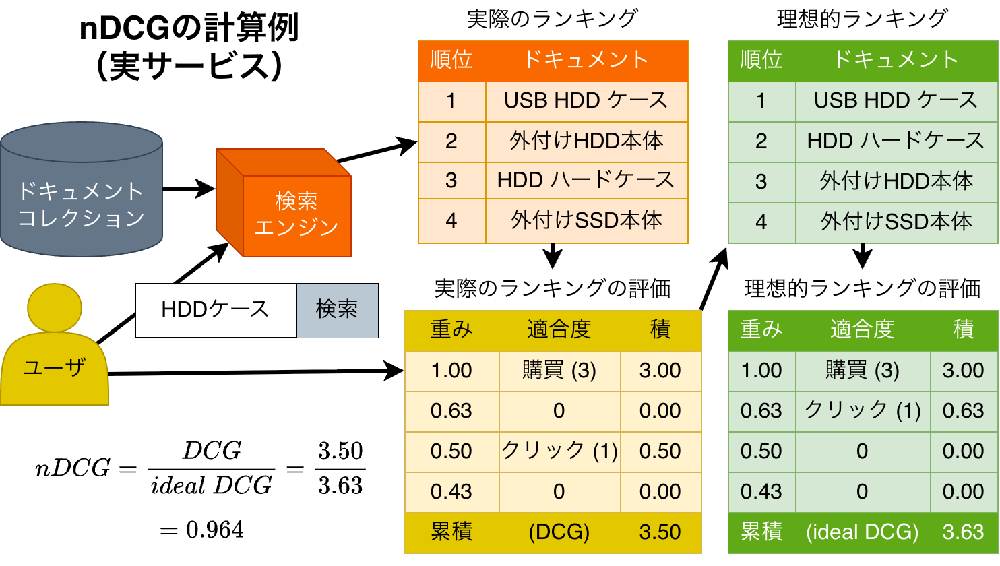
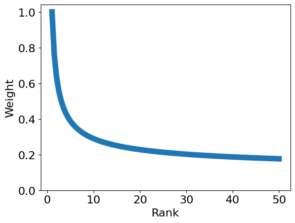

---
# https://marp.app/
marp: true

# https://x.com/y_hatt/status/1449951469961023488
style: |
    .columns {
        display: grid;
        grid-template-columns: repeat(2, minmax(0, 1fr));
    }
math: mathjax
---

# nDCGと実サービスへの応用

---

## 検索システムの評価

とは、検索システムがユーザの役に立った度合いを測ること

- 検索システムの構築や改善に目が向きがちですが、
評価も等しく重要なので、いきなり評価の話をします
- 例えば、検索システムに関する理想的なワークフローの例
1. 検索システムの構築・改善
1. **社内での評価**
1. **一部ユーザに使ってもらっての評価**
1. めでたく全ユーザに使ってもらう
1. 社内外への知見の共有

---

## 検索システムの評価の例

- クエリ：キーワード
- ドキュメント：
あるEコマースサービスの商品

のとき：

- 検索エンジンは
- ユーザの検索意図を
- どれくらい満たす
商品ランキングを返しているか？

---

## Normalized Discounted Cumulative Gain (nDCG)

- クエリに対するドキュメントのランキングの評価尺度
- 多くの良い性質を持つことから標準的な尺度
- それらの性質が名前の由来
    - Gain: クエリごとにドキュメントに点数をつける（= ユーザにとっての利得）
    - Cumulative: ドキュメントの点数を累積して、ランキングの点数とする
    - Discounted: 上位にランクインしたドキュメントほど重視
    - Normalized: クエリごとに点数を `[0, 1]` に正規化
- 数式で書くと以下

$$nDCG(Q, k) = \frac{1}{|Q|}\sum^{|Q|}_{j=1}Z_{kj}\sum^k_{m=1}\frac{2^{R(j, m)} - 1}{\log_2(1 + m)}$$

https://nlp.stanford.edu/IR-book/html/htmledition/evaluation-of-ranked-retrieval-results-1.html

---

---

## 実サービスへの適用 (nDCG)

- クエリはユーザが入力したものを使えば良い
- ランキングは実サービスの検索結果を使えば良い
- 点数としてはユーザフィードバックを使えば良い
    - クリックされたら1点
    - 購買されたら3点
    - とか……
- むしろ研究室で nDCG を計算するより楽かも

---

---

## 実サービスへの適用上の疑問 (nDCG)

実際に適用してみると、まだまだ疑問だらけ
- そもそも点数に矛盾が生じる
    - 一般に、同じクエリを発行したユーザが複数いて、
    異なるフィードバックを返す
    - なんなら、同じユーザも時により異なるフィードバックを返す
- クリック1点、購買3点で良いのか？
- 上位をどれくらい重視すべきなのか？
- すべてのクエリを等しく重視すべきなのか？

---

## そもそも点数に矛盾が生じる

例えば同じクエリ  でも……

|順位|ドキュメント|ユーザA|ユーザB|ユーザB（再訪問）|
|:-:|---|:-:|:-:|:-:|
|1|USB HDD ケース|購買|クリック|-|
|2|外付けHDD本体|-|-|-|
|3|HDD ハードケース|クリック|クリック|購買|
|4|外付けSSD本体|-|-|-|

- とか。それはユーザごと時刻ごとに検索意図が違うから
- クエリに対してではなく、検索意図に対して点数が決まる
- 研究っぽい言葉で言うと intent-aware な評価をする必要

---

## そもそも点数に矛盾が生じる (continued)

### 対策

- nDCG をクエリごとではなく、検索結果の提示 (impression) ごとに計算する

|順位|ドキュメント|ユーザA|ユーザB|ユーザB（再訪問）|
|:-:|---|:-:|:-:|:-:|
|1|USB HDD ケース|購買|クリック|-|
|2|外付けHDD本体|-|-|-|
|3|HDD ハードケース|クリック|クリック|購買|
|4|外付けSSD本体|-|-|-|
||**nDCG**|**0.964**|**0.920**|**0.500**|

$$avg. nDCG = \frac{0.964 + 0.920 + 0.500}{3} = 0.795$$

---

## クリック1点、購買3点で良いのか？

A. 何か裏付けがあった方がより良いと思われる

### 対策

- ビジネス的には購買が重要なので、クリック0点とする
    - だいたい極端すぎる対策になる
    - 購買はクリックより遥かに少ないので、評価が偏る
- クリックのnDCG（購買0点）と、
購買のnDCG（クリック0点）を別に出し、人の判断に委ねる、など……
- 一方、ほかにも有用そうなフィードバックがある（例：カートに入れる）

---

## 上位をどれくらい重視すべきなのか？

標準的なnDCGでは、
$m$位に対して $1 / \log_2(1 + m)$ と：

- 上位数件を下位の数倍重視
- 10位あたりからの差は小さい

が……

---

## 上位をどれくらい重視すべきなのか？ (continued)

A. サービスによって異なる。ランクバイアスを測定しよう

### 対策

- ランクバイアスとは、ランキング上位のドキュメントが
クエリとの関連性によらずフィードバックを受けやすいという性質
    - よくクリックされる理由として単に「よく上位に出るから」がありうる。
    「クエリに関連するから」と分離しないと検索システムの改善が難しい
- シャッフルしたドキュメントを出してみれば良い
    - それでもランクバイアスにより上位のドキュメントがクリックされる
    - 順位ごとのクリック数を数えればランクバイアスを測定できる
    - が、当然ユーザ体験を損なうので、さらに工夫が必要

---

## すべてのクエリを等しく重視すべきなのか？

A1. 標準的なnDCGは、その通りの性質を持つ

- DCGは累積的 (Cumulative) なので、
関連するドキュメントが多いクエリに対して点数を取りやすい
- しかし、それらのクエリが、ユーザにとっても重要とは言えない
- そこで、クエリごとに正規化された (Normalized) 点数を出す

---

## すべてのクエリを等しく重視すべきなのか？ (continued)

A2. 一方、そうとは言えない場合がありそう。例えばEコマースで：
- 頻繁に購買があるクエリの検索結果は、重点的に最適化したい
- そもそも関連する商品がないクエリの検索結果は、
クリックを使って最適化したとしても、購買にはつながらなさそう

### 対策

- 単に normalize をやめて、DCG を使う
    - nDCG のメリットがなくなるので、トレードオフがある
- 購買がある提示だけを使って評価する
    - やっぱりだいたい極端すぎる対策になる

---

## 最適化された評価尺度の例

- （例であり、実サービスとは異なります）

|順位|ランク バイアス|ドキュメント|ユーザA|ユーザB|ユーザB （再訪問）|
|:-:|---|---|:-:|:-:|:-:|
|1|1.00|USB HDD ケース|購買|クリック|-|
|2|0.750|外付けHDD本体|-|-|-|
|3|0.500|HDD ハードケース|クリック|クリック|購買|
|4|0.250|外付けSSD本体|-|-|-|
|||**クリックのDCG**|1.50|1.50|0.500|
|||**購買のDCG**|3.00|0.00|1.500|

クリックの平均DCG $= 1.17$, 購買の平均DCG $= 1.500$

---

## まとめ (nDCG)

- nDCGの計算式を丸覚えする必要はない
- 何故こういう式になっているのか？を意識しないと、
的外れな評価になることもある
