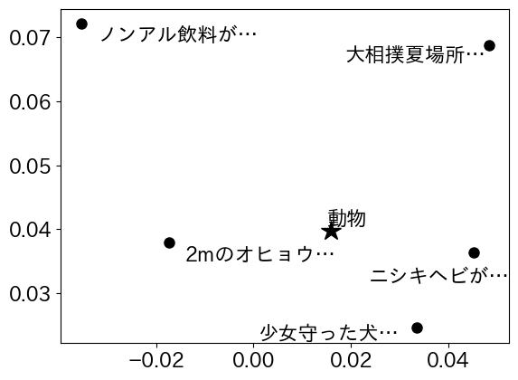

---
# https://marp.app/
marp: true

# https://x.com/y_hatt/status/1449951469961023488
style: |
    .columns {
        display: grid;
        grid-template-columns: repeat(2, minmax(0, 1fr));
    }
---

# ベクトル検索と実サービスへの応用

---

## ベクトル検索

近年、クエリとドキュメント（複数）をベクトル化して、
ベクトルの類似度によってドキュメントをランキングする流れがある
- ベクトルは実数の列。例：`[0.2, -0.4, ..., 0.0, -0.3]`
- 類似度の定義は色々だが、分かりやすいのは距離の近さ

---

## ベクトル検索 > 概念図

例えばニュース記事の検索を考える
- 事前に記事をベクトル化しておく
    - 5件を2次元ベクトル化し、
    それぞれ点 ● とした例が右図
- クエリが来たら、同様にベクトル化
    - こちらは点 ★ として図示
- ● と ★ との距離を測り、近い順に
並べると、記事がランキングできる

---

## ベクトル検索 > 利点

- キーワードの完全一致によらず、意味的な類似度を扱える
    - 例：「動物」と言ったら「犬」か「ヘビ」か？
- ベクトル化できれば何でも扱える
    - 例：キーワードで画像を検索

--- 

## ベクトル検索 > 構成例

---

## 注：「ベクトル空間モデル」とは異なる

- ベクトル空間モデルでは、ベクトルの各次元は単語に対応

|ニュース記事|少女|守る|犬|ヘビ|2m|魚|…|ベクトル表現|
|---|--:|--:|--:|--:|--:|--:|--:|---|
|少女守った犬……|1|1|1|0|0|0|…|`[1, 1, 1, 0, 0, 0, …]`|
|ニシキヘビが……|0|0|0|1|0|0|…|`[0, 0, 0, 1, 0, 0, …]`|
|2mのオヒョウ……|0|0|0|0|1|1|…|`[0, 0, 0, 0, 1, 1, …]`|
|…|…|…|…|…|…|…|…|…|

### ベクトル検索

- 機械学習で密なベクトルを得る
- 意味的な類似度を扱える

### ベクトル空間モデル

- キーワード検索の一手法
- 説明性が高く疎なベクトルを扱う

---

## ベクトル検索と多様化

- 一般に、検索結果のランキング上位は
似たドキュメントが占めがちという問題がある
- さまざまな検索意図に対応できるよう、**多様化**したい

### 手法の例：Maximal Marginal Relevance (MMR)

- すでにランクインしたドキュメントに似たドキュメントのスコアを下げる
- ベクトル検索では（クエリ-ドキュメント間だけではなく）
ドキュメント-ドキュメント間の類似度も自然に求まるので、多様化が容易

---

## ベクトル検索と多様化の例

- クエリとの類似度でランキング、
ランキング中の他のドキュメントとの類似度で多様化

※ ベクトル表現は省略した

---

## ベクトル検索と多様化の例

- クエリとの類似度でランキング、
ランキング中の他のドキュメントとの類似度で多様化

※ ベクトル表現は省略した

---

## ベクトル検索と多様化の例

- クエリとの類似度でランキング、
ランキング中の他のドキュメントとの類似度で多様化

※ ベクトル表現は省略した

---

## ベクトル検索と多様化の例

- クエリとの類似度でランキング、
ランキング中の他のドキュメントとの類似度で多様化

※ ベクトル表現は省略した

---

## ベクトル検索と多様化の例

- クエリとの類似度でランキング、
ランキング中の他のドキュメントとの類似度で多様化

※ ベクトル表現は省略した

---

## ベクトル検索と多様化の例

- クエリとの類似度でランキング、
ランキング中の他のドキュメントとの類似度で多様化

※ ベクトル表現は省略した

---

## ベクトル検索と多様化の例

- クエリとの類似度でランキング、
ランキング中の他のドキュメントとの類似度で多様化

※ ベクトル表現は省略した

---

## ベクトル検索と多様化の例

- クエリとの類似度でランキング、
ランキング中の他のドキュメントとの類似度で多様化

※ ベクトル表現は省略した

---

## ベクトル検索と多様化の例

- クエリとの類似度でランキング、
ランキング中の他のドキュメントとの類似度で多様化

※ ベクトル表現は省略した

---

## ベクトル検索と多様化の例

- クエリとの類似度でランキング、
ランキング中の他のドキュメントとの類似度で多様化

※ ベクトル表現は省略した

---

## ベクトル検索と多様化の例

- クエリとの類似度でランキング、
ランキング中の他のドキュメントとの類似度で多様化

※ ベクトル表現は省略した

---

## 実サービスへの適用上の問題（ベクトル）

ベクトル検索と多様化を実現しようとすると、
実は情報検索というより**コンピュータの構成の知識**が必要
- ベクトルの入出力の問題
- ベクトルの多様化検索と分散検索の相性

---

## ベクトルの入出力の問題

- 例えば、要件が、**毎秒1,000件のクエリベクトル**と、
**10,000件のドキュメントベクトル**との類似度の計算
- ドキュメントベクトルが `float[256]` (1KB) のとき、
$1,000\mathrm{/s} \times 10,000 \times 1\mathrm{KB} = 10\mathrm{GB/s}$ 読み込まないといけない
- ということは、ドキュメントベクトルを毎回
HDD (0.3GB/s) やSSD (3GB/s) から読むと満たさない
- メモリ (30GB/s) にキャッシュ機構を実装する必要がある

---

## ベクトルの入出力の問題 (cont'd)

- 要件：10GB/sで
CPUまでドキュメントを読む
- HDDから読むとHDD-
メモリ間がネックで 0.3GB/s
- SSDから読むとSSD-
メモリ間がネックで 3GB/s
- メモリに直接ドキュメントか
キャッシュを置く必要がある

---

## ベクトルの多様化検索と分散検索

- ベクトルの多様化検索は比較的容易と書いたが、
実は分散検索とは相性が悪い

---

## 分散検索の例

- ドキュメントコレクション全体を複数のシャードに分割、検索

---

## 分散検索の例 (continued)

- ドキュメントコレクション全体を複数のシャードに分割、検索

---

## ベクトルの多様化検索と分散検索 (continued)

- 多様化のため、サーチヘッドに
ドキュメントベクトルを集約する必要がある
    - シャードごとに多様化しても、集約したら多様でなくなるかも
- 例えば、要件が、**毎秒1,000件のクエリベクトル**に対する
**top-100ドキュメントベクトル**の多様化だったとする
- ドキュメントベクトルが `float[256]` (1KB),
シャード数が100のとき、サーチヘッドへの入力は
$1,000\mathrm{/s} \times 100 \times 1\mathrm{KB} \times 100 = 10\mathrm{GB/s}$ 生じる
- 例えばサーチヘッドのネットワークインタフェースが
25Gbps (~3.1GB/s) のイーサネットだった場合、満たさない

---

## 多様化分散検索の例

100ベクトルのランキングは $100 \times 1\mathrm{KB} = 100\mathrm{KB}$, 毎秒1,000レスポンスで100MB/s

---

## その他のトピック：ANN検索

- Approximate Nearest Neighbor；近似最近傍
- 前述のようにベクトル検索には高コストな部分があるので、
低コストに結果を近似する技術
- 非常に応用の広い技術ですが、広すぎて説明が長くなるので本資料からは割愛
- 書籍を出したので、よければ参照してください
真鍋知博：“ベクトル検索実践入門”, *技術評論社*, 2026年1月.

---

## まとめ（ベクトル検索）

- ベクトル検索は「意味」を扱える新しめの技術
- ベクトル検索に限らず、情報検索の理論は学んだとして、実装もそれなりに難しい
- プログラミングやコンピュータの基礎にも興味を持ってください
