---
# https://marp.app/
marp: true

# https://x.com/y_hatt/status/1449951469961023488
style: |
    .columns {
        display: grid;
        grid-template-columns: repeat(2, minmax(0, 1fr));
    }
---

# ベクトル検索と実サービスへの応用

---

## ベクトル化とベクトル類似検索

- 近年、クエリやドキュメントをベクトル化して、
ベクトルの類似度によってランキングを生成する流れがある
    - 正確には、「ベクトルの類似度が適合度とイコールになるように、
クエリやドキュメントをベクトル化する流れがある」？
- 例：Word2Vecとキーワード検索、畳み込みと類似画像検索

--- 

## ベクトル類似検索の例

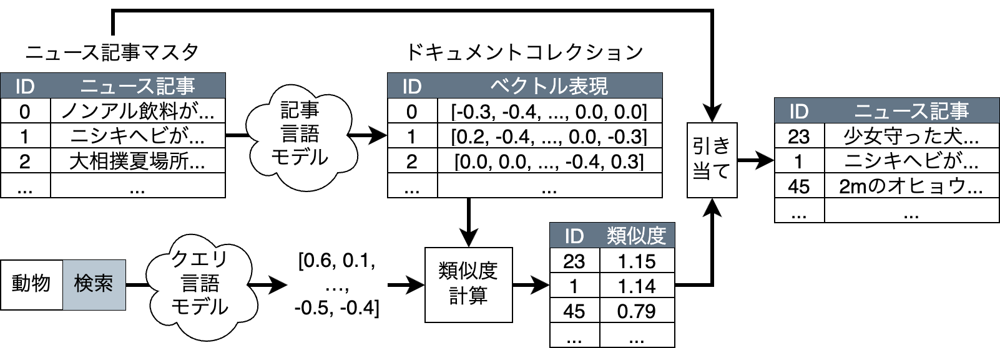

---

## 注：ベクトル空間モデルとは異なります

- ベクトル空間モデルでは、ベクトルの各次元は単語に対応

|ニュース記事|少女|守る|犬|ヘビ|2m|魚|…|ベクトル表現|
|---|--:|--:|--:|--:|--:|--:|--:|---|
|少女守った犬……|1|1|1|0|0|0|…|`[1, 1, 1, 0, 0, 0, …]`|
|ニシキヘビが……|0|0|0|1|0|0|…|`[0, 0, 0, 1, 0, 0, …]`|
|2mのオヒョウ……|0|0|0|0|1|1|…|`[0, 0, 0, 0, 1, 1, …]`|
|…|…|…|…|…|…|…|…|…|

- ベクトル検索では、そのような制約はなく、
類似度が適合度をよく表すようにベクトル化の方法を選ぶ

---

## ベクトル検索と多様化

- 一般に、検索結果のランキング上位は似たドキュメントに
占められがちという問題がある
- さまざまな検索意図に対応できるよう、**多様化**したい
- ベクトル検索では、クエリ-ドキュメント間だけではなく、
ドキュメント-ドキュメント間の類似度も自然に
（例えばコサイン類似度によって）求まるので、多様化が容易

---

## ベクトル検索と多様化の例

- クエリとの類似度でランキング、
ランキング中の他のドキュメントとの類似度で多様化

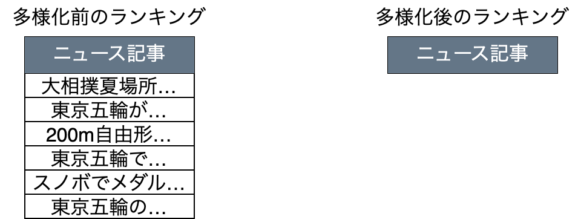

※ ベクトル表現は省略した

---

## ベクトル検索と多様化の例

- クエリとの類似度でランキング、
ランキング中の他のドキュメントとの類似度で多様化

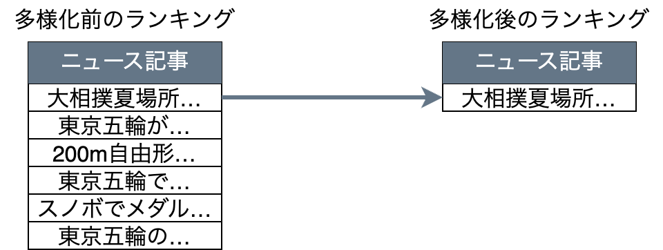

※ ベクトル表現は省略した

---

## ベクトル検索と多様化の例

- クエリとの類似度でランキング、
ランキング中の他のドキュメントとの類似度で多様化

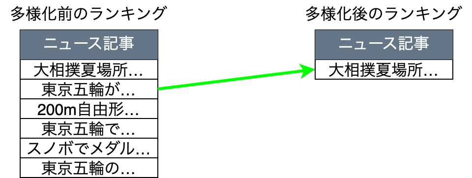

※ ベクトル表現は省略した

---

## ベクトル検索と多様化の例

- クエリとの類似度でランキング、
ランキング中の他のドキュメントとの類似度で多様化

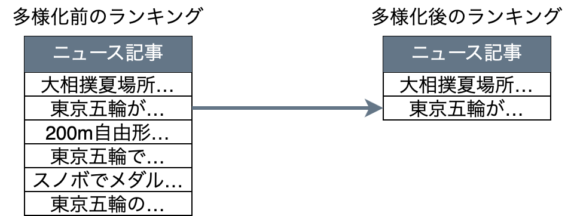

※ ベクトル表現は省略した

---

## ベクトル検索と多様化の例

- クエリとの類似度でランキング、
ランキング中の他のドキュメントとの類似度で多様化

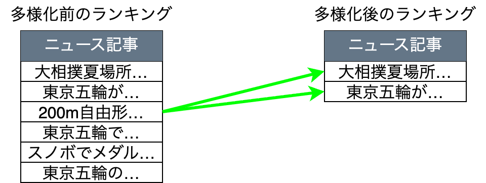

※ ベクトル表現は省略した

---

## ベクトル検索と多様化の例

- クエリとの類似度でランキング、
ランキング中の他のドキュメントとの類似度で多様化

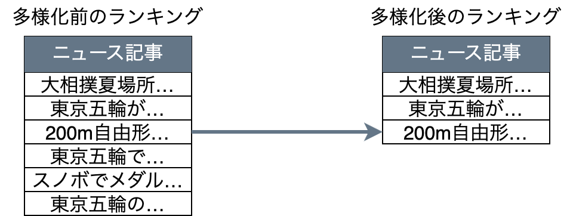

※ ベクトル表現は省略した

---

## ベクトル検索と多様化の例

- クエリとの類似度でランキング、
ランキング中の他のドキュメントとの類似度で多様化

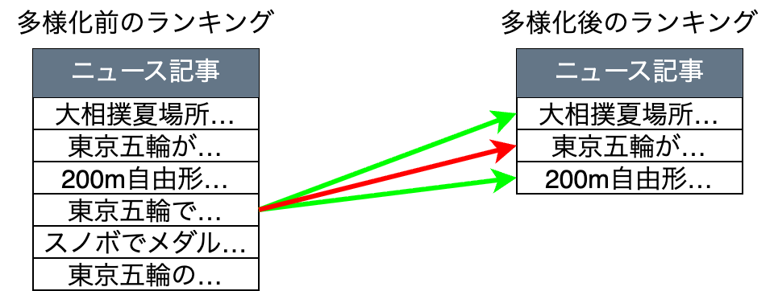

※ ベクトル表現は省略した

---

## ベクトル検索と多様化の例

- クエリとの類似度でランキング、
ランキング中の他のドキュメントとの類似度で多様化

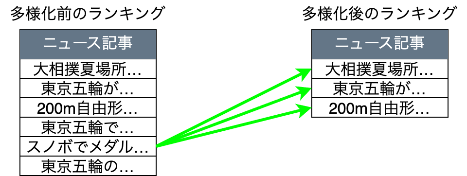

※ ベクトル表現は省略した

---

## ベクトル検索と多様化の例

- クエリとの類似度でランキング、
ランキング中の他のドキュメントとの類似度で多様化

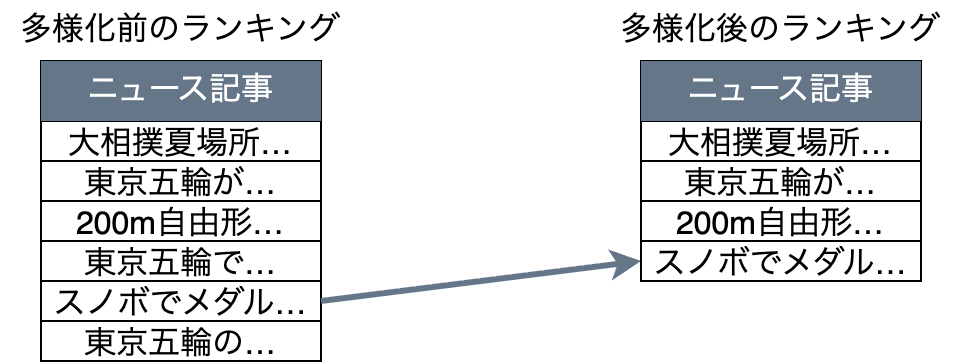

※ ベクトル表現は省略した

---

## ベクトル検索と多様化の例

- クエリとの類似度でランキング、
ランキング中の他のドキュメントとの類似度で多様化

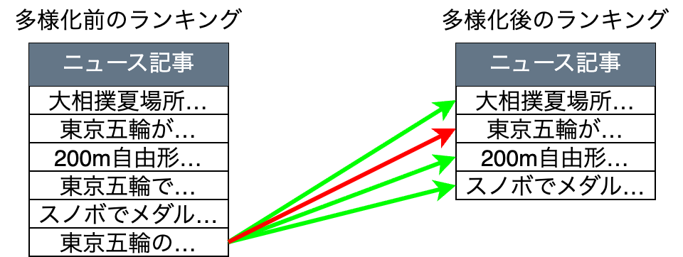

※ ベクトル表現は省略した

---

## ベクトル検索と多様化の例

- クエリとの類似度でランキング、
ランキング中の他のドキュメントとの類似度で多様化

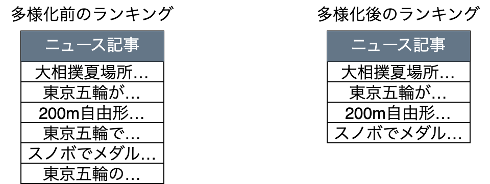

※ ベクトル表現は省略した

---

## 実サービスへの適用上の問題（ベクトル）

ベクトル類似検索と多様化を実現しようとすると、
実は情報検索というより**コンピュータの構成の知識**が必要
- ベクトルの入出力の問題
- ベクトルの多様化検索と分散検索の相性

---

## ベクトルの入出力の問題

- 例えば、要件が、**毎秒100件のクエリベクトル**と、
**10,000件のドキュメントベクトル**との類似度の計算
- ドキュメントベクトルが 256次元 float 配列 (1KB) のとき、
100/s * 10,000 * 1KB = 1GB/s 読み込まないといけない
- ということは、ドキュメントベクトルを毎回
0.1GB/s の HDD や 0.6GB/s の SSD から読むと満たさない
- メモリ (10GB/s) にキャッシュ機構を実装する必要がある

---

## ベクトルの入出力の問題 (cont'd)

- 要件：1GB/sで
CPUまでドキュメントを読む
- HDDから読むとHDD-
メモリ間がネックで 0.1GB/s
- SSDから読むとSSD-
メモリ間がネックで 0.6GB/s
- メモリに直接ドキュメントか
キャッシュを置く必要がある

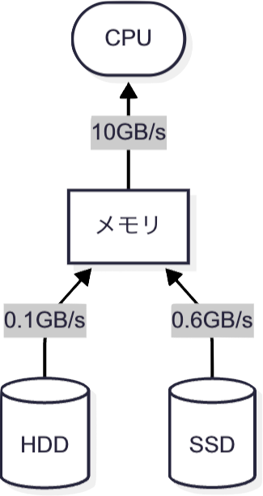

---

## ベクトルの多様化検索と分散検索

- ベクトルの多様化検索は比較的容易と書いたが、
実は分散検索とは相性が悪い

---

## 分散検索の例

- ドキュメントコレクション全体を複数のシャードに分割、検索

---

## 分散検索の例 (continued)

- ドキュメントコレクション全体を複数のシャードに分割、検索

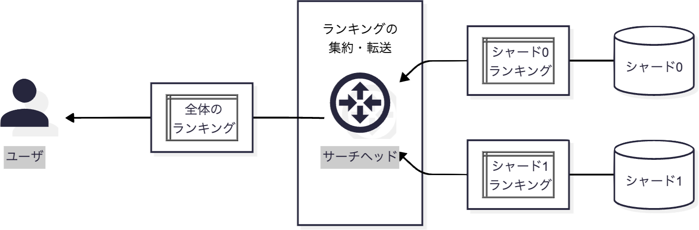

---

## ベクトルの多様化検索と分散検索 (continued)

- 多様化のため、サーチヘッドに
ドキュメントベクトルを集約する必要がある
    - シャードごとに多様化しても、集約したら多様でなくなるかも
- 例えば、要件が、**毎秒100件のクエリベクトル**に対する
**top-100ドキュメントベクトル**の多様化だったとする
- ドキュメントベクトルが 256次元 float 配列 (1KB),
シャード数が100のとき、サーチヘッドへの入力は
100/s * 100 * 1KB * 100 = 1GB/s 生じる
- 例えばサーチヘッドのネットワークインタフェースが
0.125GB/s のギガビットイーサだった場合、満たさない

---

## 多様化分散検索の例

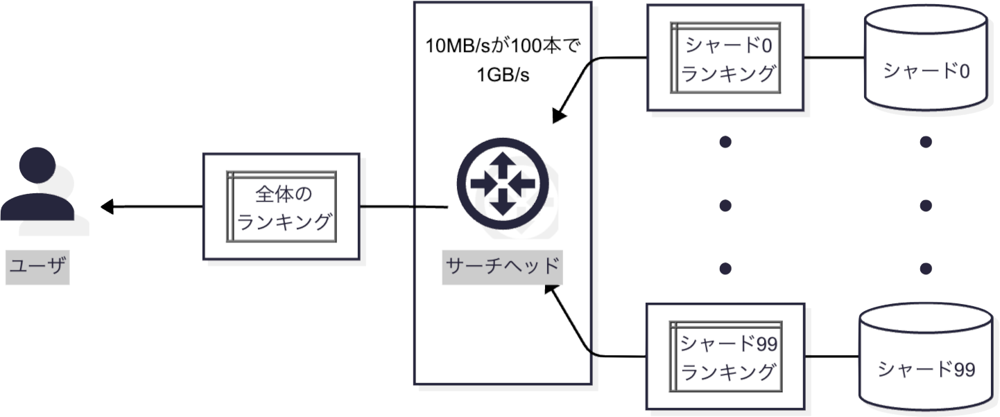

100ベクトルのランキングは100 * 1KB = 100KB, 毎秒100レスポンス返すと10MB/s

---

## まとめ（ベクトル）

- 情報検索の理論は学んだとして、実装もそれなりに難しい
- プログラミングやコンピュータの基礎にも興味を持ってください
